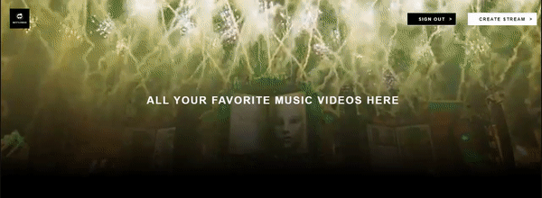
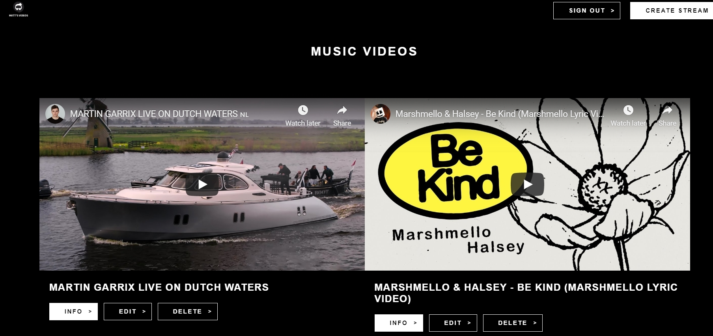
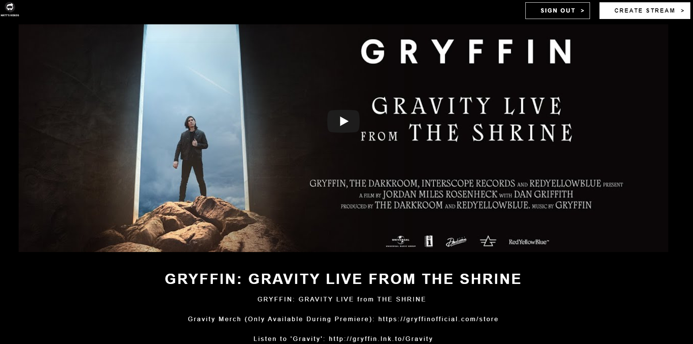
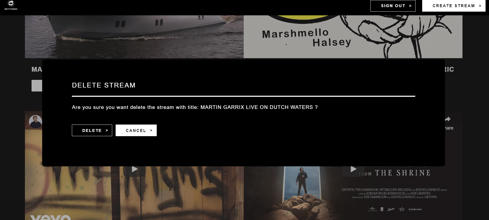
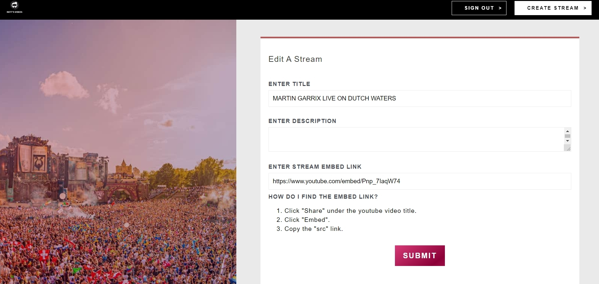
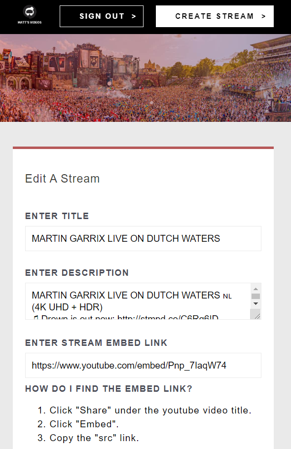

# Music Stream

A collection of music videos from Youtube. Users can stream, publish, edit, delete music videos when signed in. Users can only see other published music videos when not logged in.

However, for testing/previewing accessibility; the code is commented out so any user can edit and delete videos.

Developed with React, Redux, JS, HTML, CSS, [JSON-server for a local database communicated via REST requests](https://github.com/typicode/json-server).

# Warning

`Delete Stream Button`, and `Submit Button` for editing and creating a stream are disabled. It is done to prevent users from changing the online JSON database.

To enable the button functionality for your own local JSON database, the set up instructions are below.

# Why I Built It and What I've Learned:

-   To understand how Redux simplifies data management between components.

## Redux:

-   Manages shared or global states between components via action creators, reducers, and mapStateToProps.
-   Avoid using when state is local/only used with 1 component; or if a prop is more simple to implement.
-   Redux form is used to simplify form manipulation.
-   Redux thunk used so that async REST requests can be made.

## React:

-   React Hooks, such as useEffect(), useState(). Replaces class' this.setState().
-   Hooks are used to simplify React class' lifecycle methods. Such as using useEffect (()=>, [x]) whenever x changes. With class' lifecycle, a ComponentDidMount() with if statement checking the value of x would be needed.
-   CreatePortal() for a Modal box so that we could avoid z-index issues when a parent uses position:relative, so the child element uses the parent's z-index and compares it to other elements outside of the parent.

## External resources:

-   gAPI (Google Authentication API) for authentication. User can sign in and sign out with their google account.
-   anime.js for certain animations (eg; Loading screen).
-   Prettier to format code and EsLint for linting.
-   Redux dev tool google chrome extension to check the values of the states.
-   JSON-server for a local database.

## What It Looks Like










# Getting Started

These instructions will get you a copy of the project up and running on your local machine for development and testing purposes.

1. Clone the project. Use `npm install` to install all the dependencies. Run the project with `npm run develop` for development or `npm run build` for production.
   Note: the name 'develop' and 'build' could be configured and renamed in package.json.

2. On the terminal, go to the `database` directory. Type `npm start` to start the local JSON-server database.

3. Uncomment the import line in `actions/index.js`. The imported code would import the local JSON-server database. Comment out the axios import since it is only needed for the online database.

4. Uncomment the following code in `actions/index.js`; replace the `fetchStreams()` and `fetchStream()` with the commented out code that is meant for JSON-server local database. Comment out the rest of the code.

5. Uncomment the `onClick` functions inside the `Submit, Edit and Delete button` on `StreamForm's onSubmit()`, `StreamEdit's onSubmit()`, and `StreamList's renderModalActions()`. This will enable stream creation, edit and deletion with the local database.
   You can find the code by finding this comment:
   //DISABLED FOR DEPLOYMENT so that users can't manipuate online JSON database
   //comment out if want to use for local JSON-database

# Prerequisites

What things you need to install the software

```
- Any package manager (npm, yarn)
```

# Versioning

None
