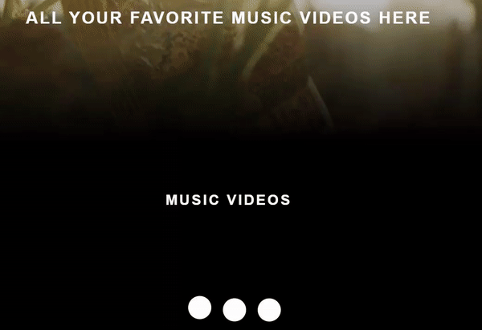

# Music Stream

A collection of music videos from Youtube. Users can stream, publish, edit, delete music videos when signed in. Users can only see other published music videos when not logged in.

Developed with React, Redux, JS, HTML, CSS, [JSON-server for a JSON database and a server/API for REST requests](https://github.com/typicode/json-server)

For storage purposes, all data created will be stored temporarily in the databse then it'll be automatically deleted after a certain amount of time.

# Why I Built It and What I've Learned:

-   To understand how Redux simplifies data management between components.
-   Understanding how a front-end needs a server to communicate to a database.

## Redux:

-   Manages shared or global states between components via action creators, reducers, and mapStateToProps.
-   Avoid using when state is local/only used with 1 component; or if a prop is more simple to implement.
-   Redux form is used to simplify form manipulation.
-   Redux thunk used so that async REST requests can be made.

## React:

-   React Hooks, such as useEffect(), useState(). Replaces class' this.setState().
-   Hooks are used to simplify React class' lifecycle methods. Such as using useEffect (()=>, [x]) whenever x changes. With class' lifecycle, a ComponentDidMount() with if statement checking the value of x would be needed.
-   CreatePortal() for a Modal box so that we could avoid z-index issues when a parent uses position:relative, so the child element uses the parent's z-index and compares it to other elements outside of the parent.

## External resources:

-   gAPI (Google Authentication API) for authentication. User can sign in and sign out with their google account.
-   anime.js for certain animations (eg; Loading screen).
-   Prettier to format code and EsLint for linting.
-   Redux dev tool google chrome extension to check the values of the states.
-   JSON-server for a local database.

## What It Looks Like





# Getting Started

These instructions will get you a copy of the project up and running on your local machine for development and testing purposes.

1. Clone the project. Use `npm install` to install all the dependencies. Run the project with `npm start` for development or `npm run build` for production.

2. OPTIONAL: If you want to make changes locally, on the terminal, go to the `backend` directory. Type `npm start` to start the local JSON-server server/api which will connect the front-end to the database. Then change the axiosConfig route file to http://localhost:3000. Uncomment the "write" code in server.js too.

# Prerequisites

What things you need to install the software

```
- Any package manager (npm, yarn)
```

# Versioning

None
